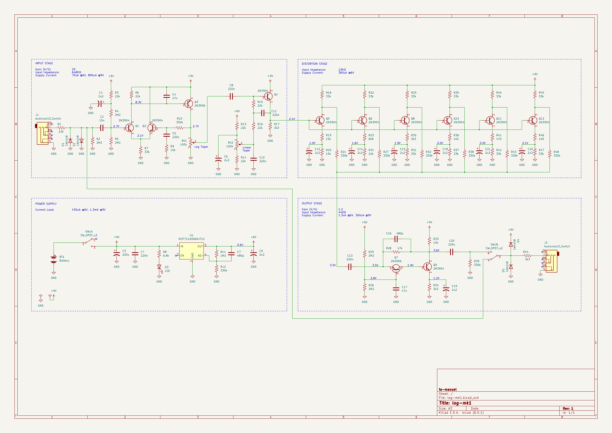
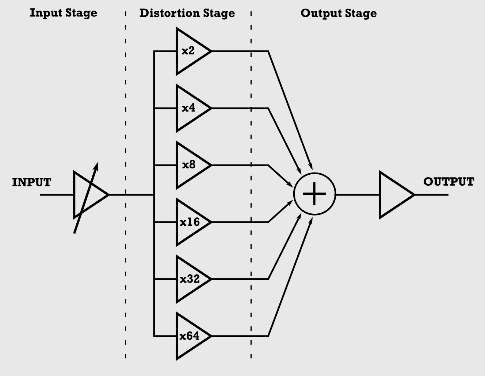

# LOG-MK1

<!-- TABLE OF CONTENTS -->

  
Table of Contents

  <ol>
    <li><a href="#about-the-project">About The Project</a></li>
    <li><a href="#block-diagram">Block Diagram</a></li>
  </ol>

<!-- ABOUT THE PROJECT -->
## About The Project
The LOG-MK1 is a guitar pedal that uses a logarithmic amplifier to boost the signal and add a little distortion.
To make it more challenging I decided to use only BJTs.

For more info check out the [project on hackaday.io](https://hackaday.io/project/185715-log-mk1)

<!-- BLOCK DIAGRAM -->
## Block Diagram
